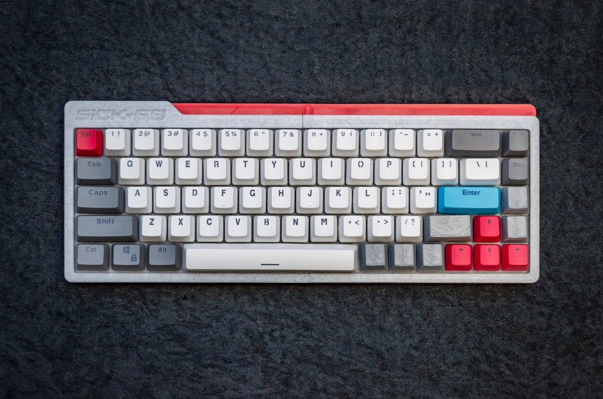
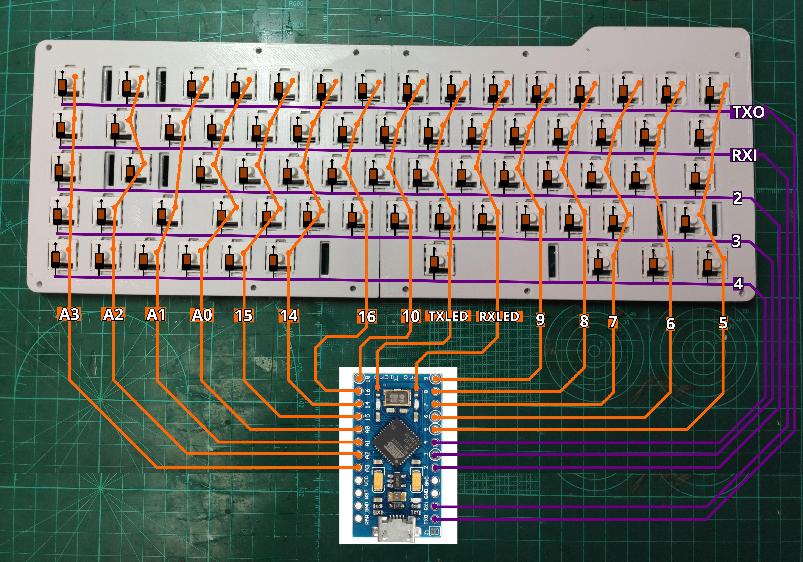

# Sick68 keyboard

 

## Print keyboard case
[thingiverse model](https://www.thingiverse.com/thing:3478494) 

## Install and compile qmk firmware
[blog link](https://www.josean.com/posts/how-to-use-code-with-qmk)

## Electric connections
 

## flash firmware
- [video](https://www.youtube.com/watch?v=JtlqvwZaod0&list=PLtUlUg1xcBFDSr3xSAQbRvALumqAQ8qxN&index=9) 
- put the micro on bootloader mode (jump **RST** and **GND** pins)
- run

```bash
$ qmk flash -kb handwired/sick68 -km default
```
or
```bash
$ avrdude -p atmega32u4 -c avr109 -P /dev/ttyACM0 -b 57600 -U flash:w:handwired_sick68_aaron.hex:iavrdude -p atmega32u4 -c avr109 -P /dev/ttyACM0 -b 57600 -U flash:w:handwired_sick68_aaron.hex:i
```
